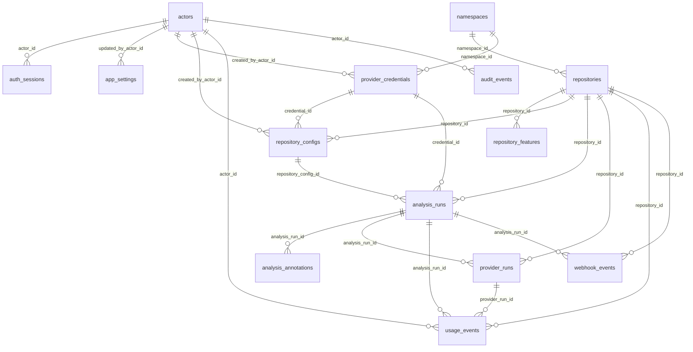
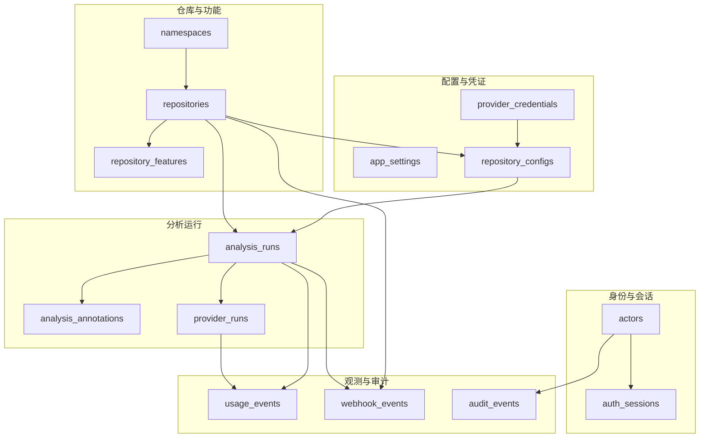
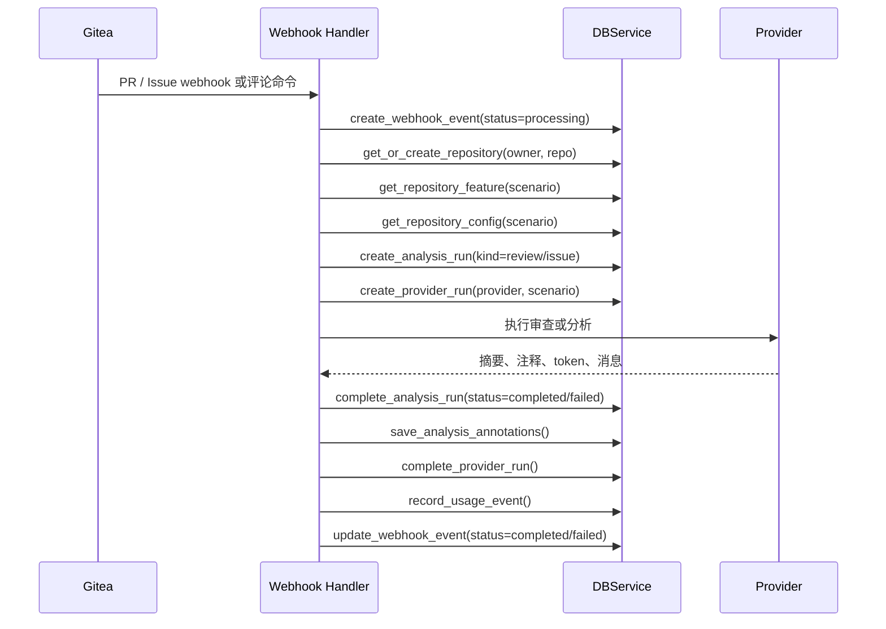

# 数据库 Schema 说明

本文档描述当前运行时数据库设计，对应 `app/models/schema.py`。当前 schema 是 Database v2 之后的统一模型：PR 审查和 Issue 分析统一记录到 `analysis_runs`，仓库运行时配置记录在 `repository_configs`，API Key 只保存在 `provider_credentials`。

## 图例

| 标记 | 含义 |
| --- | --- |
| PK | 主键 |
| FK | 外键 |
| UQ | 唯一约束 |
| IDX | 索引 |
| ENC | 加密字段，通过模型属性读写明文 |
| JSON | 以 `Text` 保存 JSON 字符串 |
| NULL | 允许为空 |

继承 `TimestampMixin` 的表都包含：

| 字段 | 类型 | 键/约束 | 说明 |
| --- | --- | --- | --- |
| `created_at` | `DateTime` | NOT NULL | 创建时间，默认 `func.now()`。 |
| `updated_at` | `DateTime` | NOT NULL | 更新时间，默认 `func.now()`，更新时 `onupdate=func.now()`。 |

继承 `TimestampMixin` 的表：`actors`、`auth_sessions`、`app_settings`、`namespaces`、`repositories`、`repository_features`、`provider_credentials`、`repository_configs`、`analysis_runs`、`provider_runs`、`webhook_events`。

## 总览图



## 领域分层图



## 关键业务流图



## 表详解

### `actors`

系统行为主体，包含普通用户、管理员和 `system` actor。

| 字段 | 类型 | 键/约束 | 说明 |
| --- | --- | --- | --- |
| `id` | `Integer` | PK | 自增主键。 |
| `external_provider` | `String(50)` | NOT NULL, UQ 组合 | 外部身份来源，例如 `gitea` 或 `system`。 |
| `external_username` | `String(255)` | NOT NULL, UQ 组合 | 外部用户名。 |
| `display_name` | `String(255)` | NULL | 展示名称。 |
| `email` | `String(255)` | NULL | 邮箱。 |
| `role` | `String(50)` | NOT NULL, default `user` | 角色，例如 `user`、`admin`、`super_admin`、`system`。 |
| `permissions_json` | `Text` | NULL, JSON | 权限 JSON 字符串。 |
| `is_active` | `Boolean` | NOT NULL, default `true` | 是否启用。 |
| `last_login_at` | `DateTime` | NULL | 最近登录时间。 |

唯一约束：`uq_actors_external_identity(external_provider, external_username)`。

兼容属性：`username` 映射 `external_username`，`permissions` 映射 `permissions_json`，`is_super_admin` 判断 `role == super_admin`。

### `auth_sessions`

登录会话。Cookie token 不直接入库，只保存 SHA-256 hash；OAuth token 加密保存。

| 字段 | 类型 | 键/约束 | 说明 |
| --- | --- | --- | --- |
| `id` | `Integer` | PK | 自增主键。 |
| `session_token_hash` | `String(64)` | NOT NULL, UQ, IDX | 会话 token 的 hash。 |
| `actor_id` | `Integer` | FK -> `actors.id`, IDX, NULL, ON DELETE SET NULL | 会话所属 actor。 |
| `access_token_enc` | `Text` | NOT NULL, ENC | 加密后的访问 token。 |
| `refresh_token_enc` | `Text` | NULL, ENC | 加密后的刷新 token。 |
| `scopes_json` | `Text` | NULL, JSON | OAuth scopes。 |
| `user_info_json` | `Text` | NULL, JSON | 登录用户信息快照。 |
| `expires_at` | `DateTime` | NOT NULL, IDX | 过期时间。 |
| `revoked_at` | `DateTime` | NULL | 撤销时间。 |

关系：`actor` -> `Actor`。加密属性：`access_token` / `refresh_token` 分别读写 `access_token_enc` / `refresh_token_enc`。

### `app_settings`

系统运行设置，值统一以 JSON 字符串保存。

| 字段 | 类型 | 键/约束 | 说明 |
| --- | --- | --- | --- |
| `id` | `Integer` | PK | 自增主键。 |
| `key` | `String(100)` | NOT NULL, UQ, IDX | 设置键。 |
| `category` | `String(50)` | NOT NULL, IDX | 设置分类。 |
| `value_json` | `Text` | NOT NULL, JSON | 设置值 JSON 字符串。 |
| `description` | `Text` | NULL | 设置说明。 |
| `updated_by_actor_id` | `Integer` | FK -> `actors.id`, NULL, ON DELETE SET NULL | 最近更新者。 |

### `namespaces`

Gitea owner 命名空间，可代表用户或组织。

| 字段 | 类型 | 键/约束 | 说明 |
| --- | --- | --- | --- |
| `id` | `Integer` | PK | 自增主键。 |
| `provider` | `String(50)` | NOT NULL, UQ 组合, default `gitea` | 代码托管平台。 |
| `name` | `String(255)` | NOT NULL, UQ 组合 | owner 名称。 |
| `kind` | `String(50)` | NOT NULL, default `unknown` | owner 类型，例如用户、组织或未知。 |
| `display_name` | `String(255)` | NULL | 展示名称。 |

唯一约束：`uq_namespaces_provider_name(provider, name)`。

### `repositories`

仓库主体表，记录被监控、审查或分析的 Gitea 仓库。

| 字段 | 类型 | 键/约束 | 说明 |
| --- | --- | --- | --- |
| `id` | `Integer` | PK | 自增主键。 |
| `provider` | `String(50)` | NOT NULL, UQ 组合, default `gitea` | 代码托管平台。 |
| `namespace_id` | `Integer` | FK -> `namespaces.id`, IDX, NULL, ON DELETE SET NULL | 所属 namespace。 |
| `owner` | `String(255)` | NOT NULL, UQ 组合, IDX | 仓库 owner。 |
| `name` | `String(255)` | NOT NULL, UQ 组合, IDX | 仓库名。 |
| `full_name` | `String(511)` | NOT NULL, IDX | 完整仓库名，例如 `owner/repo`。 |
| `webhook_secret_enc` | `Text` | NULL, ENC | 加密后的仓库 webhook secret。 |
| `is_active` | `Boolean` | NOT NULL, default `true` | 仓库是否启用。 |

唯一约束：`uq_repositories_name(provider, owner, name)`。关系：`namespace` -> `Namespace`。兼容属性：`repo_name` 映射 `name`，setter 会同步 `full_name`。加密属性：`webhook_secret` 读写 `webhook_secret_enc`。

### `repository_features`

仓库按场景的功能开关。目前主要用于 `review` 和 `issue` 两类场景。

| 字段 | 类型 | 键/约束 | 说明 |
| --- | --- | --- | --- |
| `id` | `Integer` | PK | 自增主键。 |
| `repository_id` | `Integer` | FK -> `repositories.id`, NOT NULL, IDX, ON DELETE CASCADE | 所属仓库。 |
| `scenario` | `String(50)` | NOT NULL, UQ 组合, IDX | 场景，例如 `review` 或 `issue`。 |
| `enabled` | `Boolean` | NOT NULL, default `true` | 该场景是否启用。 |
| `auto_on_open` | `Boolean` | NOT NULL, default `true` | PR/Issue 打开时是否自动触发。 |
| `manual_command_enabled` | `Boolean` | NOT NULL, default `true` | 是否允许评论命令手动触发。 |

唯一约束：`uq_repository_features_scenario(repository_id, scenario)`。

### `provider_credentials`

Provider 凭证表，当前唯一保存 API Key 的业务表。

| 字段 | 类型 | 键/约束 | 说明 |
| --- | --- | --- | --- |
| `id` | `Integer` | PK | 自增主键。 |
| `scope_type` | `String(50)` | NOT NULL | 凭证作用域类型，例如 `system`、`namespace`、`repository`。 |
| `scope_key` | `String(100)` | NOT NULL, UQ 组合, IDX | 作用域键，例如 `system` 或 `repo:123`。 |
| `namespace_id` | `Integer` | FK -> `namespaces.id`, NULL, ON DELETE SET NULL | namespace 级凭证关联。 |
| `name` | `String(150)` | NOT NULL, UQ 组合 | 凭证名称。 |
| `provider` | `String(50)` | NOT NULL | Provider 类型，例如 `anthropic`、`custom`。 |
| `api_url` | `String(500)` | NULL | Provider API 地址。 |
| `api_key_enc` | `Text` | NULL, ENC | 加密后的 API Key。 |
| `is_active` | `Boolean` | NOT NULL, default `true` | 凭证是否启用。 |
| `created_by_actor_id` | `Integer` | FK -> `actors.id`, NULL, ON DELETE SET NULL | 创建者。 |
| `last_used_at` | `DateTime` | NULL | 最近使用时间。 |

唯一约束：`uq_provider_credentials_scope_name(scope_key, name)`。加密属性：`api_key` 读写 `api_key_enc`。

### `repository_configs`

仓库真正运行时使用的独立配置。仓库配置不直接保存 API Key，只通过 `credential_id` 引用 `provider_credentials`。

| 字段 | 类型 | 键/约束 | 说明 |
| --- | --- | --- | --- |
| `id` | `Integer` | PK | 自增主键。 |
| `repository_id` | `Integer` | FK -> `repositories.id`, NOT NULL, IDX, ON DELETE CASCADE | 所属仓库。 |
| `scenario` | `String(50)` | NOT NULL, UQ 组合, IDX | 配置场景，例如 `review` 或 `issue`。 |
| `engine` | `String(100)` | NOT NULL | 审查/分析引擎；默认 `forge`，启用 legacy 后可为 `claude_code`、`codex_cli`。迁移 `f3a7b1c8d2e4` 已将历史值统一切换为 `forge`。 |
| `model` | `String(200)` | NULL | 模型名称。 |
| `credential_id` | `Integer` | FK -> `provider_credentials.id`, NULL, ON DELETE SET NULL | 使用的 Provider 凭证。 |
| `api_url_override` | `String(500)` | NULL | 仓库级 API URL 覆盖值。 |
| `wire_api` | `String(50)` | NULL | Provider 通信协议或 API 形态，例如 responses/chat-completions。 |
| `temperature` | `Float` | NULL | 模型温度参数。 |
| `max_tokens` | `Integer` | NULL | 最大输出 token。 |
| `custom_prompt` | `Text` | NULL | 仓库级自定义提示词。 |
| `focus_json` | `Text` | NULL, JSON | 分析重点数组。 |
| `features_json` | `Text` | NULL, JSON | 输出功能数组。 |
| `is_active` | `Boolean` | NOT NULL, default `true` | 配置是否启用。 |
| `created_by_actor_id` | `Integer` | FK -> `actors.id`, NULL, ON DELETE SET NULL | 创建者。 |

唯一约束：`uq_repository_configs_scenario(repository_id, scenario)`。关系：`credential` -> `ProviderCredential`。

属性与 helper：`api_url` 优先返回 `api_url_override`，否则返回 `credential.api_url`；`api_key` 通过凭证读写；`default_features` 映射 `features_json`；`default_focus` 映射 `focus_json`；`get_features()` / `set_features()` 读写功能数组；`get_focus()` / `set_focus()` 读写重点数组。

### `analysis_runs`

统一分析运行记录。PR 审查和 Issue 分析都写入此表，通过 `kind` 区分。

| 字段 | 类型 | 键/约束 | 说明 |
| --- | --- | --- | --- |
| `id` | `Integer` | PK | 自增主键。 |
| `kind` | `String(50)` | NOT NULL, IDX | 分析类型，例如 `review` 或 `issue`。 |
| `repository_id` | `Integer` | FK -> `repositories.id`, NOT NULL, IDX, ON DELETE CASCADE | 所属仓库。 |
| `external_number` | `Integer` | NOT NULL, IDX | 外部编号，PR number 或 Issue number。 |
| `external_title` | `String(500)` | NULL | PR/Issue 标题。 |
| `external_author` | `String(255)` | NULL | PR/Issue 作者。 |
| `external_state` | `String(50)` | NULL | 外部状态，主要用于 Issue 状态。 |
| `source_branch` | `String(255)` | NULL | 源分支，主要用于 PR。 |
| `target_branch` | `String(255)` | NULL | 目标分支，主要用于 PR。 |
| `head_sha` | `String(64)` | NULL | PR head commit SHA。 |
| `trigger_type` | `String(50)` | NOT NULL | 触发方式，例如 webhook、manual。 |
| `source_comment_id` | `Integer` | NULL | 触发命令的评论 ID。 |
| `bot_comment_id` | `Integer` | NULL | 机器人发布的评论 ID。 |
| `effective_engine` | `String(100)` | NULL | 实际使用的引擎。 |
| `effective_model` | `String(200)` | NULL | 实际使用的模型。 |
| `repository_config_id` | `Integer` | FK -> `repository_configs.id`, NULL, ON DELETE SET NULL | 本次运行使用的仓库配置。 |
| `credential_id` | `Integer` | FK -> `provider_credentials.id`, NULL, ON DELETE SET NULL | 本次运行使用的凭证。 |
| `status` | `String(50)` | NOT NULL, default `running` | 运行状态，例如 `running`、`completed`、`failed`。 |
| `overall_success` | `Boolean` | NULL | 整体是否成功。 |
| `overall_severity` | `String(50)` | NULL | 整体严重级别。 |
| `summary_markdown` | `Text` | NULL | 分析摘要 Markdown。 |
| `result_payload_json` | `Text` | NULL, JSON | 结构化结果 payload。 |
| `error_message` | `Text` | NULL | 错误信息。 |
| `started_at` | `DateTime` | NOT NULL | 开始时间。 |
| `completed_at` | `DateTime` | NULL | 完成时间。 |
| `duration_seconds` | `Float` | NULL | 运行耗时秒数。 |

关系：`repository` -> `Repository`。兼容属性：`pr_number` / `issue_number` 映射 `external_number`，`pr_title` / `issue_title` 映射 `external_title`，`pr_author` / `issue_author` 映射 `external_author`，`head_branch` 映射 `source_branch`，`base_branch` 映射 `target_branch`，`engine` 映射 `effective_engine`，`model` / `model_name` 映射 `effective_model`，`analysis_payload` 映射 `result_payload_json`。

JSON helper：`get_analysis_payload()` 解析结果 payload；`get_features()` 读取 `enabled_features`；`get_focus()` 读取 `focus_areas`；`config_source` 读取 payload 中的 `config_source`。

### `analysis_annotations`

分析产生的结构化注释或行级评论。该表没有继承 `TimestampMixin`，只有单独的 `created_at`。

| 字段 | 类型 | 键/约束 | 说明 |
| --- | --- | --- | --- |
| `id` | `Integer` | PK | 自增主键。 |
| `analysis_run_id` | `Integer` | FK -> `analysis_runs.id`, NOT NULL, IDX, ON DELETE CASCADE | 所属分析运行。 |
| `annotation_type` | `String(50)` | NOT NULL | 注释类型，例如 `inline_comment`。 |
| `file_path` | `String(500)` | NULL | 文件路径。 |
| `new_line` | `Integer` | NULL | 新文件行号。 |
| `old_line` | `Integer` | NULL | 旧文件行号。 |
| `severity` | `String(50)` | NULL | 严重级别。 |
| `body` | `Text` | NOT NULL | 注释内容。 |
| `suggestion` | `Text` | NULL | 修复建议。 |
| `created_at` | `DateTime` | NOT NULL | 创建时间。 |

兼容属性：`path` 映射 `file_path`，`comment` 映射 `body`。

### `provider_runs`

Provider 执行明细，用于记录模型调用、会话、token、工具调用和消息等底层执行轨迹。

| 字段 | 类型 | 键/约束 | 说明 |
| --- | --- | --- | --- |
| `id` | `Integer` | PK | 自增主键。 |
| `analysis_run_id` | `Integer` | FK -> `analysis_runs.id`, IDX, NULL, ON DELETE SET NULL | 关联的分析运行。 |
| `repository_id` | `Integer` | FK -> `repositories.id`, IDX, NULL, ON DELETE SET NULL | 关联仓库。 |
| `provider` | `String(50)` | NOT NULL, UQ 组合, IDX | Provider 名称，例如 `forge`。 |
| `provider_session_id` | `String(64)` | NOT NULL, UQ 组合 | Provider 会话 ID。 |
| `scenario` | `String(50)` | NOT NULL, IDX | 场景，例如 `review` 或 `issue`。 |
| `status` | `String(50)` | NOT NULL, default `running` | 执行状态。 |
| `model` | `String(200)` | NULL | 实际模型。 |
| `turns` | `Integer` | NOT NULL, default `0` | 对话轮数。 |
| `tool_calls_count` | `Integer` | NOT NULL, default `0` | 工具调用次数。 |
| `messages_json` | `Text` | NULL, JSON | Provider 消息记录。 |
| `input_tokens` | `Integer` | NOT NULL, default `0` | 输入 token。 |
| `output_tokens` | `Integer` | NOT NULL, default `0` | 输出 token。 |
| `cache_creation_input_tokens` | `Integer` | NOT NULL, default `0` | 创建缓存消耗的输入 token。 |
| `cache_read_input_tokens` | `Integer` | NOT NULL, default `0` | 读取缓存命中的输入 token。 |
| `started_at` | `DateTime` | NOT NULL | 开始时间。 |
| `completed_at` | `DateTime` | NULL | 完成时间。 |
| `duration_seconds` | `Float` | NULL | 执行耗时秒数。 |
| `error_message` | `Text` | NULL | 错误信息。 |

唯一约束：`uq_provider_runs_session(provider, provider_session_id)`。关系：`repository` -> `Repository`。兼容属性：`session_id` 映射 `provider_session_id`。

### `usage_events`

用量明细事件，记录 token、API 调用、克隆次数等计量数据。该表没有继承 `TimestampMixin`，只有单独的 `created_at`。

| 字段 | 类型 | 键/约束 | 说明 |
| --- | --- | --- | --- |
| `id` | `Integer` | PK | 自增主键。 |
| `analysis_run_id` | `Integer` | FK -> `analysis_runs.id`, IDX, NULL, ON DELETE SET NULL | 关联分析运行。 |
| `provider_run_id` | `Integer` | FK -> `provider_runs.id`, IDX, NULL, ON DELETE SET NULL | 关联 Provider 执行。 |
| `repository_id` | `Integer` | FK -> `repositories.id`, NOT NULL, IDX, ON DELETE CASCADE | 关联仓库。 |
| `actor_id` | `Integer` | FK -> `actors.id`, IDX, NULL, ON DELETE SET NULL | 关联 actor。 |
| `event_date` | `Date` | NOT NULL, IDX | 统计日期。 |
| `provider` | `String(50)` | NULL | Provider 名称。 |
| `input_tokens` | `Integer` | NOT NULL, default `0` | 输入 token。 |
| `output_tokens` | `Integer` | NOT NULL, default `0` | 输出 token。 |
| `cache_creation_input_tokens` | `Integer` | NOT NULL, default `0` | 创建缓存消耗的输入 token。 |
| `cache_read_input_tokens` | `Integer` | NOT NULL, default `0` | 读取缓存命中的输入 token。 |
| `gitea_api_calls` | `Integer` | NOT NULL, default `0` | Gitea API 调用次数。 |
| `provider_api_calls` | `Integer` | NOT NULL, default `0` | Provider API 调用次数。 |
| `clone_operations` | `Integer` | NOT NULL, default `0` | 仓库克隆次数。 |
| `created_at` | `DateTime` | NOT NULL | 事件写入时间。 |

### `webhook_events`

Webhook 事件处理记录，用于追踪 Gitea webhook 的处理状态和重放来源。

| 字段 | 类型 | 键/约束 | 说明 |
| --- | --- | --- | --- |
| `id` | `Integer` | PK | 自增主键。 |
| `request_id` | `String(100)` | NOT NULL, UQ, IDX | 请求 ID，用于追踪与去重。 |
| `repository_id` | `Integer` | FK -> `repositories.id`, IDX, NULL, ON DELETE CASCADE | 关联仓库。 |
| `analysis_run_id` | `Integer` | FK -> `analysis_runs.id`, NULL, ON DELETE SET NULL | 关联分析运行。 |
| `event_type` | `String(50)` | NOT NULL, IDX | Webhook 事件类型。 |
| `payload_json` | `Text` | NOT NULL, JSON | 原始 payload JSON 字符串。 |
| `status` | `String(50)` | NOT NULL, IDX | 处理状态。 |
| `error_message` | `Text` | NULL | 错误信息。 |
| `processing_time_ms` | `Integer` | NOT NULL, default `0` | 处理耗时毫秒数。 |
| `retry_count` | `Integer` | NOT NULL, default `0` | 重试次数。 |

### `audit_events`

所有写操作的审计事件。该表没有继承 `TimestampMixin`，只有单独的 `created_at`。注意：`repository_id` 和 `namespace_id` 是普通整数引用，不是严格外键，便于审计记录在资源删除后仍保留。

| 字段 | 类型 | 键/约束 | 说明 |
| --- | --- | --- | --- |
| `id` | `Integer` | PK | 自增主键。 |
| `actor_id` | `Integer` | FK -> `actors.id`, IDX, NULL, ON DELETE SET NULL | 操作者。 |
| `actor_type` | `String(50)` | NOT NULL | 操作者类型，例如 user、system、migration。 |
| `action` | `String(100)` | NOT NULL, IDX | 动作名称。 |
| `resource_type` | `String(100)` | NOT NULL, IDX | 资源类型。 |
| `resource_id` | `Integer` | NULL | 资源 ID。 |
| `repository_id` | `Integer` | IDX, NULL | 相关仓库 ID，非严格 FK。 |
| `namespace_id` | `Integer` | NULL | 相关 namespace ID，非严格 FK。 |
| `request_id` | `String(100)` | NULL | 请求 ID。 |
| `source` | `String(50)` | NOT NULL | 来源，例如 api、webhook、migration。 |
| `ip_address` | `String(100)` | NULL | 客户端 IP。 |
| `user_agent` | `Text` | NULL | User-Agent。 |
| `before_json` | `Text` | NULL, JSON | 变更前快照。 |
| `after_json` | `Text` | NULL, JSON | 变更后快照。 |
| `changed_fields_json` | `Text` | NULL, JSON | 变更字段列表。 |
| `sensitive_fields_json` | `Text` | NULL, JSON | 被脱敏的敏感字段列表。 |
| `status` | `String(50)` | NOT NULL | 审计动作结果，例如 success、failure。 |
| `error_message` | `Text` | NULL | 失败原因。 |
| `created_at` | `DateTime` | NOT NULL | 审计事件创建时间。 |

## 删除行为与数据保留

| 来源表 | 目标表 | on delete | 影响 |
| --- | --- | --- | --- |
| `actors` | `auth_sessions` / `usage_events` / `audit_events` 等 | SET NULL | 删除 actor 后保留业务记录。 |
| `namespaces` | `repositories` / `provider_credentials` | SET NULL | 删除 namespace 后保留仓库和凭证。 |
| `repositories` | `repository_features` / `repository_configs` / `analysis_runs` / `usage_events` / `webhook_events` | CASCADE | 删除仓库会删除大量运行与观测数据；实际业务更适合优先软删除 `is_active=false`。 |
| `repositories` | `provider_runs` | SET NULL | Provider 执行记录保留，仓库引用置空。 |
| `provider_credentials` | `repository_configs` / `analysis_runs` | SET NULL | 删除凭证后配置和历史运行保留，但凭证引用置空。 |
| `analysis_runs` | `analysis_annotations` | CASCADE | 删除运行会删除对应注释。 |
| `analysis_runs` | `provider_runs` / `usage_events` / `webhook_events` | SET NULL | 删除运行后保留执行、用量和 webhook 记录。 |
| `provider_runs` | `usage_events` | SET NULL | 删除执行记录后保留用量事件。 |

## 当前设计注意点

1. `analysis_runs` 使用 `kind` 统一 PR 审查和 Issue 分析，避免维护两套生命周期表。
2. API Key、OAuth token、webhook secret 都通过 `*_enc` 字段加密保存，并通过属性读写明文。
3. 配置模板表已从运行时模型中移除；当前运行时只读取 `repository_configs`。
4. 多个 JSON 字段使用 `Text` 保存，便于 SQLite 兼容，但复杂查询和数据校验依赖应用层。
5. 审计表刻意弱化部分资源外键，以保留删除后的历史上下文。
6. SQLite 默认部署时，需要额外关注外键 PRAGMA、并发写锁、大 JSON 字段增长和历史数据保留策略。

## 从 v2.3.0 回退的迁移指引

v2.3.0 引入的 tag 区间审查与飞书推送已在 `4f3e23e` 永久回退，其对应的迁移文件（原 `0003`）也已删除。曾升级到 v2.3.0 的环境，`alembic_version` 表仍停留在 `0003`，物理 schema 仍残留 `analysis_runs.from_tag` / `to_tag` 列。直接 `alembic upgrade head` 会报 `Can't locate revision identified by '0003'`。

`0004` 迁移负责收敛这一差异：

- **Docker 部署**：`docker/docker-entrypoint.sh` 已内置容错——`alembic upgrade head` 失败且 stderr 含 `Can't locate revision` 时，自动 `alembic stamp 0002 --purge` 后重试，无需人工干预。
- **手动部署 / 本地**：执行一次即可自愈：
  ```bash
  uv run alembic stamp 0002 --purge   # 把版本号从 0003 重置到 0002
  uv run alembic upgrade head         # 跑到 0004，幂等 drop from_tag/to_tag
  ```

`0004` 的 `upgrade()` 用 `_has_column` 幂等检查：从未升级到 v2.3.0 的环境（无 from_tag/to_tag 列）会安全跳过，曾升级的环境会实际 drop。`downgrade()` 为 no-op——tag_review 功能已永久移除，不还原这两列。
